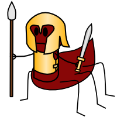

# myrmidon

<!-- badges: start -->
[](https://github.com/francisbarton/myrmidon/actions)
<!-- badges: end -->

## Personal functions and templates, from the whimsical to the useful to the rather experimental.

> The Myrmidons of Greek myth were known for their loyalty to their leaders, so that in pre-industrial Europe the word "myrmidon" carried many of the same connotations that "robot" does today. [wikipedia](https://en.m.wikipedia.org/wiki/Myrmidons#Modern_Myrmidons)

<figure style="margin: 30px;">
  
  <figcaption><em>Myrmidon cartoon – represented as a half-ant, half-human warrior creature – by <a href="https://lostinbrittany.org/blog/2006/09/28/monstres-pour-la-grece-fantastique/">Horacio Gonzalez</a>.</em></figcaption>
 </figure>

> What do ants best represent in the cosmos? [Carol] Anelli reports [E.O.] Wilson insisting that they "do it all" and dominate on a number of fronts. They are exceedingly diverse -- predators, farmers, architects -- and are highly social. [Delahoyde & Hughes, 2008](https://web.archive.org/web/20080224072456/http://www.wsu.edu/~delahoyd/myrmidons.html)

### Functions

Some useful functions you will find in here:

* postcode_data_join: Get postcode data from postcodes.io and join it to an existing df
* batch_it: Turn a vector into a batched list
* save_it: Wrapper for saveRDS - a quick way to save an object to an Rds file
* gmaps_to_sf: Convert Google Maps lat-lon Data to a Geospatial sf object
* year_dates: Create vectors of dates for one or more years (and/or months)
* bbox_to_poly: Convert a bbox to an sf geospatial polygon (rectangle)


### Examples

#### postcode_data_join

```r
postcodes <- c("HD1 2UT", "HD1 2UU", "HD1 2UV")
test_df1 <- dplyr::tibble(place = paste0("place_", 1:3), postcode = postcodes)
postcode_data_join(test_df1)
```


### HTML5 RMarkdown template

*details...*
=======


```
